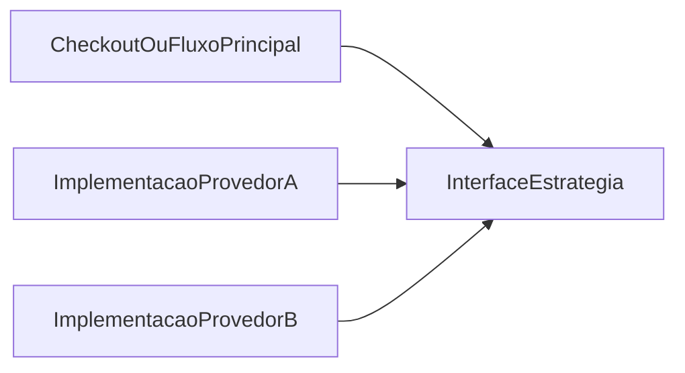

# Design Patterns não são sobre código, são sobre sobrevivência técnica

**Trilha:** foundation · **Slug:** `foundation/01-introducao-design-patterns`

---

## Introdução

A engenharia de software moderna sofre de uma síndrome perigosa: a pressa que ignora a estrutura. Frequentemente, entregamos funcionalidades hoje que se tornam os pesadelos de manutenção de amanhã. Se você já sentiu que “tocar” em uma parte do sistema causa bugs em lugares imprevisíveis, você não tem apenas um problema de código; você tem um problema de **design**.

Design Patterns, ou Padrões de Projeto, são frequentemente ensinados como uma lista de receitas — o que é um erro. Na prática, eles são o **vocabulário compartilhado** que separa sistemas resilientes de castelos de cartas prestes a desmoronar. Mais do que sintaxe: são uma forma de **gestão de complexidade** e de **redução de débito técnico**.

Neste texto, desmistificamos o que esses padrões representam para o negócio e como influenciam a produtividade de um time de tecnologia — com um exemplo concreto ao final.

---

## Contexto e problema

**Cenário:** Carlos é Tech Lead em uma fintech em rápido crescimento. A equipe precisa integrar um novo provedor de pagamento. Para ganhar velocidade, o desenvolvedor cria uma integração direta, com condicionais `if/else` espalhados para tratar as particularidades desse parceiro.

**Sintoma:** funciona. No primeiro dia.

**Problema:** três meses depois, a empresa precisa de mais dois provedores. A base de código parece um emaranhado de fios. Cada nova integração leva mais tempo que a anterior, e o risco de quebrar o fluxo principal de pagamentos é alto.

O que Carlos e a equipe enfrentam é **rigidez** (difícil de mudar) e **fragilidade** (fácil de quebrar). Tentaram resolver um problema sistêmico com uma solução pontual — a chamada “solução criativa” que cobra juros depois.

---

## Conceito técnico central

Diferente de um algoritmo (que foca em *como* computar algo), um Design Pattern foca em **como organizar a relação entre os componentes** do seu sistema.

**Definição:** padrões de projeto são **soluções testadas para problemas recorrentes** no desenho de software orientado a objetos. Não são trechos prontos para copiar e colar em qualquer linguagem; são **ideias de estrutura** que você adapta ao contexto.

**O que são:**

- **Um vocabulário comum:** quando alguém diz “vamos usar um *Strategy* aqui”, a equipe entende a intenção de tornar um comportamento **intercambiável** sem espalhar regras pelo sistema.
- **Blueprints de resiliência:** ajudam a isolar o que **varia** do que permanece **estável**, para que mudanças futuras não explodam em cascata.

**O que não são:**

- **Bala de prata:** usar padrões onde não há complexidade gera *overengineering* — mais camadas, mesma dívida moral.
- **Regras rígidas:** devem ser adaptados à linguagem, ao domínio e ao tamanho do time.

---

## Implicações práticas: da rigidez à flexibilidade

No caso de Carlos, a solução não era “escrever mais código da mesma forma”, mas mudar a **estratégia** de organização. Entra o padrão **Strategy**: em vez de espalhar lógica de pagamento, define-se uma **interface comum**; cada provedor vira uma **implementação isolada**. O fluxo principal só sabe *pedir o processamento*; não precisa conhecer detalhes de cada parceiro.

**Pseudocódigo ilustrativo:**

```text
// Em vez de:
Se (provedor == "A") { ... } Senão Se (provedor == "B") { ... }

// Strategy:
Interface MeioPagamento { processar(valor); }

Classe ProvedorA implementa MeioPagamento { ... }
Classe ProvedorB implementa MeioPagamento { ... }

Classe ProcessadorPagamento {
    executar(MeioPagamento metodo, valor) { metodo.processar(valor); }
}
```

Assim, um novo provedor tende a ser **adição** de código em um lugar previsível — não mais um risco para todo o fluxo. O aprofundamento técnico do padrão Strategy (quando usar, limitações, analogias) está no artigo dedicado deste repositório; veja a seção **Onde está o código** abaixo.

**Diagrama conceitual (visão executiva):**



---

## Síntese executiva

Para gestores e executivos, disciplina de design e alinhamento a padrões reconhecíveis costumam refletir em indicadores que times de elite medem (por exemplo, métricas no espírito **DORA**):

1. **Time-to-market:** mudanças em sistemas bem estruturados tendem a ser mais previsíveis e rápidas.
2. **Débito técnico:** menos “gambiarras” significam menos tempo apagando incêndio em código legado.
3. **Onboarding:** novos desenvolvedores entendem mais rápido um projeto que fala a mesma “língua” que o mercado.
4. **Escala de time:** várias pessoas podem evoluir partes diferentes com menos conflito e medo de regressão.

---

## Conclusão

Design Patterns não existem para deixar o código “mais bonito” no papel; existem para torná-lo **viável no longo prazo**. Um sistema sem critérios de design é um sistema com prazo de validade curto — que desvia orçamento de inovação para manter o *status quo* funcionando.

A maturidade de um time de engenharia aparece quando ele antecipa **onde o software vai doer** e aplica o remédio estrutural **antes** da dor virar crise.


Como você equilibra hoje a velocidade de entrega e a clareza de design — e em que ponto do seu sistema essa tensão aparece com mais força?
---

## Onde está o código neste repositório

- **Este artigo (introdução):** `docs/foundation/01-introducao-design-patterns/artigo.md`
- **Artigo técnico sobre Strategy:** [docs/patterns/behavioral/strategy/artigo.md](../../patterns/behavioral/strategy/artigo.md)
- **Python:** `src/python/src/designpatterns_examples/behavioral/strategy/` — exemplos de **estratégias de preço/desconto** (`pricing`) e de **processamento de pagamento** com provedores intercambiáveis (`payment_processing`).
- **C#:** `src/csharp/src/DesignPatterns.Examples/Behavioral/Strategy/` — mesma ideia espelhada (preços + pagamentos).


