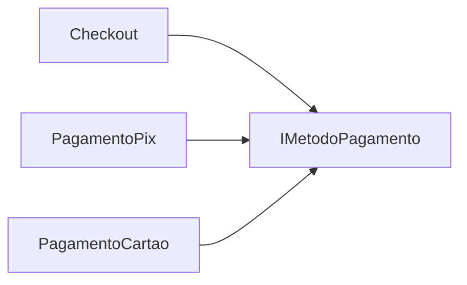

# O Código que não Envelhece: Por que a POO ainda é o Alicerce da Escalabilidade?

**Trilha:** foundation · **Slug:** `foundation/02-revisao-poo`

---

## Introdução

Muitos desenvolvedores acreditam que a Programação Orientada a Objetos (POO) é apenas uma disciplina teórica da faculdade ou um “mal necessário” de linguagens como Java e C#. Com a ascensão do paradigma funcional e de arquiteturas orientadas a eventos, surgiu o questionamento: a POO ainda é relevante?

A resposta curta é: **mais do que nunca**. No entanto, o problema não está no paradigma, mas em **como o aplicamos**. O código que “apodrece” rápido nas empresas geralmente não sofre por excesso de objetos, mas por **falta de abstração e encapsulamento real**.

Neste artigo, revisitamos a POO sob a ótica de quem precisa entregar software que sobrevive a mudanças de requisitos sem quebrar o sistema inteiro como um castelo de cartas — com foco nos **pilares que sustentam escala de time e evolução do domínio**, não na quantidade de classes no diagrama.

---

## Contexto e problema

**Cenário:** Lucas é Tech Lead em uma fintech em crescimento. O sistema de processamento de pagamentos, que começou simples, virou um labirinto. Sempre que o time precisa acrescentar um novo meio de pagamento (Pix, cripto, voucher), o trabalho dói: uma classe `ProcessadorPagamento` com milhares de linhas, repleta de `if/else` e `switch` que inspecionam tipo e estado o tempo todo.

**Sintoma:** o código é **frágil**. Uma alteração na regra do cartão de crédito quebra o cálculo da taxa do boleto.

**Impacto:** o *time-to-market* aumenta, a confiança do negócio cai e a dívida técnica vira impeditivo para inovar. O sintoma é “classe infinita”; a causa profunda é **acoplamento** e **vazamento de detalhes** — exatamente o que bons limites orientados a objetos existem para conter.

---

## Conceito técnico central

A essência da POO não é “criar classe para tudo”, e sim **gerenciar dependências** e **esconder complexidade** por trás de fronteiras estáveis.

**Definição:** POO é um mecanismo para criar **fronteiras protegidas** no código — onde estado e o comportamento que o governa ficam juntos, com invariantes e regras de uso explícitas para o restante do sistema.

**O que é:**

- **Fronteiras claras:** dados e operações que fazem sentido no mesmo contexto vivem encapsulados; quem está “fora” negocia via contratos, não acessa estruturas internas à vontade.
- **Substituibilidade controlada:** quando o domínio exige variações (meios de pagamento, regras de preço, políticas), **polimorfismo** permite tratar “o quê” sem reabrir a caixa de `if` a cada mudança.

**O que não é:**

- **Só getters e setters:** expor tudo como propriedades mutáveis sem invariantes é, na prática, um **Anemic Domain Model** — classes que são sacos de dados e espalham regra procedural em serviços gigantes.
- **Modelagem literal do “mundo real”:** POO serve ao **modelo do negócio e da mudança** que você precisa suportar, não a uma taxonomia enciclopédica de substantivos.

### Polimorfismo e encapsulamento: o pilar da mudança

A programação procedural costuma acoplar o fluxo ao **como** cada caso é feito (passo a passo, ramificações). A POO bem aplicada desloca o foco para **quem** executa e **o quê** se pede no contrato: o orquestrador chama `pagamento.Executar()` sem conhecer o manual da adquirente, a rede Pix ou o voucher — **desde que** cada implementação honre o contrato e preserve invariantes internas.

---

## Implicações práticas: refatorando o caos

Para atacar o problema do Lucas, combinamos **interface (abstração)**, **implementações concretas (encapsulamento)** e **injeção de dependência**: cada meio de pagamento vira um objeto autônomo; o checkout não “sabe” detalhes, só depende do contrato.

**Exemplo em C#:**

```csharp
// Contrato (abstração)
interface IMetodoPagamento {
    void Processar(double valor);
}

// Implementações (encapsulamento)
class PagamentoPix : IMetodoPagamento {
    public void Processar(double valor) { /* Lógica específica do Pix */ }
}

class PagamentoCartao : IMetodoPagamento {
    public void Processar(double valor) { /* Lógica complexa de adquirente */ }
}

// Orquestrador: só conhece o contrato
class Checkout {
    private readonly IMetodoPagamento _metodo;

    public Checkout(IMetodoPagamento metodo) {
        _metodo = metodo;
    }

    public void ConcluirCompra(double total) {
        _metodo.Processar(total);
    }
}
```

**Resultado:** se amanhã entrar um novo meio (por exemplo, um canal experimental), basta **adicionar** uma classe que implemente `IMetodoPagamento`. O `Checkout` permanece estável — isso é o **Princípio Aberto/Fechado (OCP)** em ação: aberto a extensão, fechado para modificação desnecessária do núcleo.

**Diagrama conceitual (visão executiva):**



---

## Síntese executiva

1. **Resiliência:** POO bem usada **isola falhas e mudanças** — uma alteração em um módulo não deve cascatear para todo o sistema quando os contratos e invariantes estão claros.
2. **Manutenibilidade:** responsabilidades explícitas tornam o código mais **legível e previsível**; menos “caça ao `if`” significa menos medo de regressão.
3. **Escalabilidade de time:** fronteiras estáveis permitem que **várias pessoas evoluam partes diferentes** em paralelo, com menos conflitos e com revisão focada no contrato.
4. **Alinhamento com evolução do negócio:** o objetivo não é “ser OO” no papel, e sim **sustentar mudanças de requisito** sem sacrificar qualidade — velocidade sem design costuma ser dívida com juros altos.

---

## Conclusão

A Programação Orientada a Objetos não é sobre espelhar o mundo real de forma literal, e sim sobre **construir um modelo que acompanhe a evolução do negócio**. O “espaguete” moderno muitas vezes nasce de quem domina a sintaxe, mas ignora os **princípios de design** que a POO sustenta há décadas: encapsular, contratar, substituir, evoluir sem quebrar o centro do sistema.

**-->:** como está a saúde da sua arquitetura hoje — e, quando o prazo aperta, o design de objetos (contratos e fronteiras) ainda entra na conta, ou só entra mais uma camada de condicionais?

---

## Onde está o código neste repositório

- **Este artigo (revisão de POO):** `docs/foundation/02-revisao-poo/artigo.md`
- **Artigo técnico sobre Strategy (aprofundamento do padrão):** [docs/patterns/behavioral/strategy/artigo.md](../../patterns/behavioral/strategy/artigo.md) — a mesma ideia de **meios de pagamento intercambiáveis** via contrato + implementações é explorada como padrão GoF.
- **Python:** `src/python/src/designpatterns_examples/behavioral/strategy/` — estratégias de preço/desconto (`pricing`) e processamento de pagamento com provedores plugáveis (`payment_processing`).
- **C#:** `src/csharp/src/DesignPatterns.Examples/Behavioral/Strategy/` — espelhado (preços + pagamentos).

