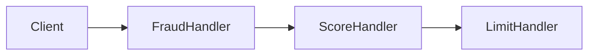

# O fim do "código espaguete": escalando lógica com Chain of Responsibility

**Categoria GoF:** comportamental. **Slug:** `behavioral/chain-of-responsibility`

---

## Introdução

A agilidade no desenvolvimento de software moderno trouxe um efeito colateral perigoso: a acumulação de regras de negócio complexas dentro de métodos que deveriam ser simples. Abrir um serviço e encontrar uma sequência interminável de `if-else` ou `switch` que parece não ter fim é mais comum do que gostaríamos de admitir.

Essa estrutura, embora funcional no início, torna-se um pesadelo de manutenção. Cada nova regra aumenta o risco de regressão, dificulta testes unitários e fere o Princípio da Responsabilidade Única (SRP). No ambiente corporativo, onde o tempo de resposta ao mercado é vital, o **código rígido** é um dos maiores freios à inovação.

O padrão **Chain of Responsibility** (CoR) oferece uma saída: em vez de um método monolítico, uma **cadeia de manipuladores** independentes, cada um com uma responsabilidade clara.

---

## Contexto e problema

**Cenário:** **Lucas**, arquiteto de software em uma fintech em rápido crescimento, lidera o motor de análise de crédito. O processo começou simples: validar o score. Meses depois, o negócio exigiu validação de KYC (Know Your Customer), análise de fraude, verificação de limites internos e consulta a birôs externos.

**Personagens:** Lucas e o time tentando entregar sem quebrar o que já funciona; negócio pedindo novas regras em cadeia; QA e produção sofrendo com regressões em validações acopladas.

- **Onde aparece:** pipelines de aprovação, middleware HTTP, validação de documentos, regras de compliance.
- **Sintomas:** classe `AnaliseCreditoService` com centenas de linhas; **fragilidade** ao mudar a ordem das validações; **testes difíceis** (para testar a última regra, é preciso simular todas as anteriores); **rigidez** ao incluir um novo parceiro ou etapa.
- **Impactos:** aumento do *time-to-market*; bugs em produção; medo de refatorar o “arquivo central”.

---

## Conceito técnico central

**Definição:** **Chain of Responsibility** é um padrão comportamental (GoF) que permite passar uma solicitação por uma **corrente de manipuladores** (*handlers*). Cada um decide **processar** (e possivelmente encerrar o fluxo) ou **repassar** ao próximo elo.

- **O que é:** desacoplamento entre quem **dispara** a solicitação e quem a **trata**; vários objetos podem ter chance de intervir, em sequência.
- **O que não é:** um *pipeline* em que **todas** as etapas obrigatoriamente transformam os dados da mesma forma. No CoR, um elo pode **interromper** o fluxo quando a regra for satisfeita ou quando houver um bloqueio (por exemplo, reprovação por fraude).

**Vantagens:** menor acoplamento; extensão alinhada ao aberto/fechado (novos handlers sem editar os existentes); testes mais focados por regra.

**Limitações:** se a corrente não for bem definida, uma solicitação pode chegar ao fim **sem tratamento** (“queda no limbo”) — é preciso política explícita (handler final, log, erro padrão).

**Analogia:** uma solicitação de crédito que passa por mesa de fraude → score → limite: se a fraude barra, as etapas seguintes nem precisam rodar.

**Anti-padrões:** corrente mal montada (encadeamento errado); handlers que conhecem demais uns aos outros; ausência de tratamento para “ninguém lidou com isso”.

---

## Implicações práticas e aplicação

**Arquitetura:** defina um contrato comum (`Processar` / `handle`) e um mecanismo de encadeamento (`SetNext` ou composição na montagem do grafo de dependências). O ponto de entrada só conhece o **primeiro** elo.

**Processo:** novas regras viram **novas classes**; code review e ownership por handler reduzem conflitos de merge.

**Código (ideia):** classe base abstrata com referência ao próximo handler e implementações por regra (fraude, score, limite). **Atenção ao encadeamento:** chamar `SetNext` duas vezes no **mesmo** objeto substitui o elo intermediário. O correto é ligar **elo a elo**:

```csharp
var fraude = new FraudeHandler();
var score = new ScoreHandler();
var limite = new LimiteInternoHandler();
fraude.SetNext(score);
score.SetNext(limite);
fraude.Processar(minhaSolicitacao);
```

Ou, se preferir fluência, faça `SetNext` retornar o próximo handler para encadear em uma única expressão — desde que a semântica fique clara para o time.

**Diagrama (visão geral):**



---

## Na prática: refatorando o motor de crédito

Uma interface comum para os elos pode ser assim:

```csharp
public abstract class AnaliseHandler {
    protected AnaliseHandler? _next;

    public void SetNext(AnaliseHandler next) => _next = next;

    public abstract void Processar(SolicitacaoCredito solicitacao);
}
```

Implementações isolam a lógica; em caso de bloqueio, não se chama o próximo; caso contrário, delega:

```csharp
public class FraudeHandler : AnaliseHandler {
    public override void Processar(SolicitacaoCredito solicitacao) {
        if (DetectouFraude(solicitacao))
            throw new CreditRejectedException("Reprovado por suspeita de fraude.");
        _next?.Processar(solicitacao);
    }
}
```

Para erros de domínio, prefira **exceções tipadas** ou um **resultado explícito** (sucesso/rejeição com motivo) em vez de `Exception` genérica — facilita testes e tratamento na API.

Os exemplos completos deste repositório seguem essa linha em Python e C#.

---

## Síntese executiva

1. **Manutenibilidade:** regras isoladas em classes pequenas e legíveis.
2. **Escalabilidade de time:** desenvolvedores podem trabalhar em handlers diferentes com menos conflito.
3. **Flexibilidade:** ordem da corrente e novos elos podem ser ajustados na composição (ou configuração), sem inflar um único método.

---

## Conclusão e apelo à ação

O Chain of Responsibility ajuda a transformar fluxos monolíticos em pipelines **modulares** e mais seguros de evoluir. A pergunta não é só se o código funciona hoje, mas **quanto custa alterá-lo amanhã**. Acúmulo de condicionais é dívida técnica com juros altos; padrões como o CoR são uma forma de pagar essa dívida com design.

**Onde está o código neste repositório**

- Artigo: `docs/patterns/behavioral/chain-of-responsibility/artigo.md`
- Python: `src/python/src/designpatterns_examples/behavioral/chain_of_responsibility/` — `credit_analysis.py` (cadeia de análise de crédito).
- C#: `src/csharp/src/DesignPatterns.Examples/Behavioral/ChainOfResponsibility/CreditAnalysis.cs` — mesma ideia; montagem da corrente em `CreditAnalysisChainFactory.BuildDefaultChain()`.

---

## Pergunta para o LinkedIn

Como você lida com o crescimento das regras de negócio no seu sistema atual? Já utilizou o Chain of Responsibility ou prefere outras abordagens, como o padrão Specification? Vamos debater nos comentários.
